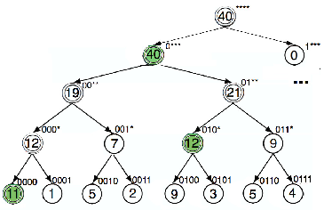

# Hierarchical Heavy Hitter (HHH) Detection using P4

How to test P4 HHH application?

## P4 Mininet enviroment setup

Download a clean Mininet 2.2.1 VM on Ubuntu 14.04 (64 bit) at [this link](https://github.com/mininet/mininet/wiki/Mininet-VM-Images).

Clone two p4lang Github repos:

    cd ~
    git clone --recursive https://github.com/p4lang/p4c.git p4c
    git clone --recursive https://github.com/p4lang/behavioral-model.git bmv2

Each of these repositories comes with dependecies. You can find instructions how to install them [here](https://github.com/p4lang/p4c/blob/master/README.md#dependences) for p4c and [here](https://github.com/p4lang/behavioral-model#dependencies) for bmv2.

Build the code once all the dependencies have been installed:

    cd ~/bmv2
    ./autogen.sh
    ./configure
    make

    cd ~/p4c
    ./bootstrap.sh
    cd build
    make

## P4 HHH application setup

Clone Monitoring SDN repository:

    cd ~
    git clone https://bitbucket.org/GianniAntichi/monitoring_sdn.git monsdn

Update the values of the shell variables *BMV2_PATH* and *P4C_PATH* in the *env.sh* file -- located in the *~/monsdn/code* directory of this repository. Note that if you cloned both repositories in the same directory as this one (Monitoring SDN), you will not need to change the value of the variables.

To run an application:

    cd ~/monsdn/code
    make run

On another terminal start digest client:

    cd ~/monsdn/code
    ./tools/controller/digest_client

Now open the terminal h1 and start traffic generator:

    mininet> xterm h1
    h1# ./tools/send_traffic.py

Each generated packet has a length of 100 bytes. Threshold for HH detection is set to 10000 bytes. Timeouts for the detection are set to 10 seconds (active) and 60 seconds (inactive). Prefix tree of source IP addresses shows the volume of traffic sent by each IP prefix (in pps). The nodes with double circle should be detected as pure heavy hitters and highlighted nodes should be detected as hierarchical heavy hitters.

Output of the digest client looks like this:

    mininet@mininet-vm:~/monsdn/HHH/hhhv2$ ./tools/controller/digest_client
    timestamp: 075351661, vector: 0x00000000, hhh: 0, prefix_found: 10.0.0.0, prefix_len: 28, value: 9900
    timestamp: 077404133, vector: 0x00000010, hhh: 0, prefix_found: 10.0.0.0, prefix_len: 29, value: 9900
    timestamp: 082416215, vector: 0x00000018, hhh: 0, prefix_found: 10.0.0.4, prefix_len: 30, value: 19400
    timestamp: 083325181, vector: 0x00000018, hhh: 0, prefix_found: 10.0.0.0, prefix_len: 30, value: 9900
    timestamp: 091336967, vector: 0x0000001c, hhh: 0, prefix_found: 10.0.0.0, prefix_len: 31, value: 15500
    timestamp: 091384711, vector: 0x0000001c, hhh: 0, prefix_found: 10.0.0.4, prefix_len: 31, value: 17700
    timestamp: 100356004, vector: 0x0000001a, hhh: 0, prefix_found: 10.0.0.0, prefix_len: 32, value: 10800
    timestamp: 101411364, vector: 0x0000001a, hhh: 1, prefix_found: 10.0.0.4, prefix_len: 31, value: 11600
    timestamp: 103431083, vector: 0x00000018, hhh: 1, prefix_found: 10.0.0.0, prefix_len: 29, value: 14500
    timestamp: 110356486, vector: 0x0000001d, hhh: 1, prefix_found: 10.0.0.0, prefix_len: 32, value: 10000
    timestamp: 111435661, vector: 0x0000001a, hhh: 1, prefix_found: 10.0.0.4, prefix_len: 31, value: 12100
    timestamp: 120381037, vector: 0x00000019, hhh: 1, prefix_found: 10.0.0.0, prefix_len: 32, value: 11100
    timestamp: 121408040, vector: 0x00000018, hhh: 1, prefix_found: 10.0.0.0, prefix_len: 29, value: 16900
    timestamp: 121447295, vector: 0x0000001a, hhh: 1, prefix_found: 10.0.0.4, prefix_len: 31, value: 12100
    timestamp: 130394810, vector: 0x00000019, hhh: 1, prefix_found: 10.0.0.0, prefix_len: 32, value: 11100
    timestamp: 131423910, vector: 0x00000018, hhh: 1, prefix_found: 10.0.0.0, prefix_len: 29, value: 17100
    timestamp: 131463466, vector: 0x0000001a, hhh: 1, prefix_found: 10.0.0.4, prefix_len: 31, value: 12100
    ...

Each line represents digest sent from the P4 switch to the controller. At the begining of the output all pure heavy hitters (hhh: 0) are reported. Then after a while when the detection method stabilizes, hierarchical heavy hitters (hhh: 1) start to be reported periodically every 10 seconds (active timeout).
